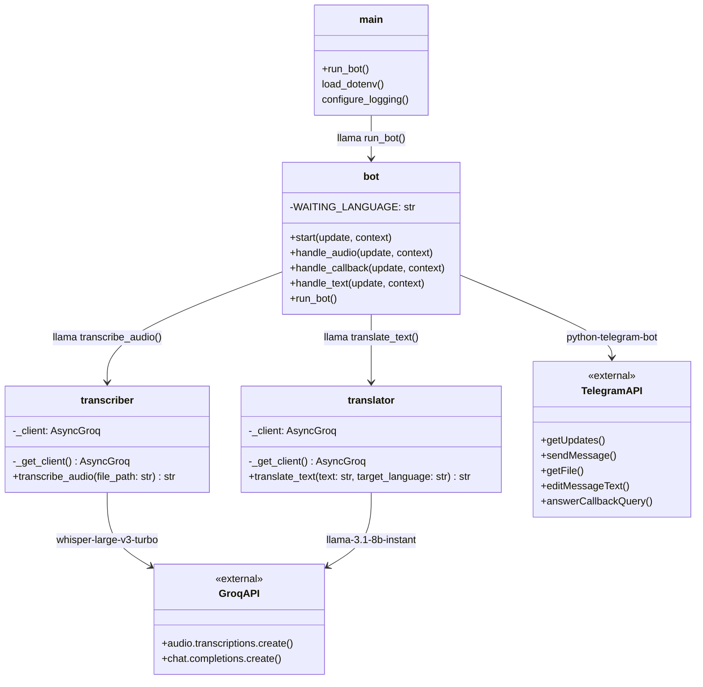

# Diagrama de Clases y Módulos

El proyecto está organizado en módulos Python. No utiliza clases orientadas a objetos de forma explícita, sino funciones y estado gestionado por `python-telegram-bot`. El diagrama refleja la estructura real de módulos, funciones y dependencias.

---

## Diagrama

---

## Descripción de módulos

### `main.py`
Punto de entrada de la aplicación. Carga las variables de entorno desde `.env`, configura el sistema de logging y arranca el bot.

### `src/bot.py`
Núcleo del bot. Registra los handlers de Telegram y gestiona el flujo de conversación mediante `context.user_data`:

| Variable en `user_data` | Tipo | Descripción |
|---|---|---|
| `state` | `str \| None` | Estado actual del usuario. `WAITING_LANGUAGE` si espera idioma de traducción |
| `last_transcription` | `str` | Última transcripción generada, disponible para traducción |

**Handlers registrados:**

| Handler | Trigger | Función |
|---|---|---|
| `CommandHandler("start")` | `/start` | `start()` |
| `MessageHandler(VOICE \| AUDIO)` | Audio o voz | `handle_audio()` |
| `CallbackQueryHandler` | Botones inline | `handle_callback()` |
| `MessageHandler(TEXT)` | Texto libre | `handle_text()` |

### `src/transcriber.py`
Gestiona la transcripción de audio. Envía el archivo a la API de Groq (modelo `whisper-large-v3-turbo`) y retorna el texto. El cliente `AsyncGroq` se instancia una sola vez (singleton).

### `src/translator.py`
Gestiona la traducción de texto. Envía el texto y el idioma destino a Groq Chat Completions (modelo `llama-3.1-8b-instant`) con un prompt de sistema que instruye al LLM a devolver únicamente la traducción. El cliente `AsyncGroq` se instancia una sola vez (singleton).
