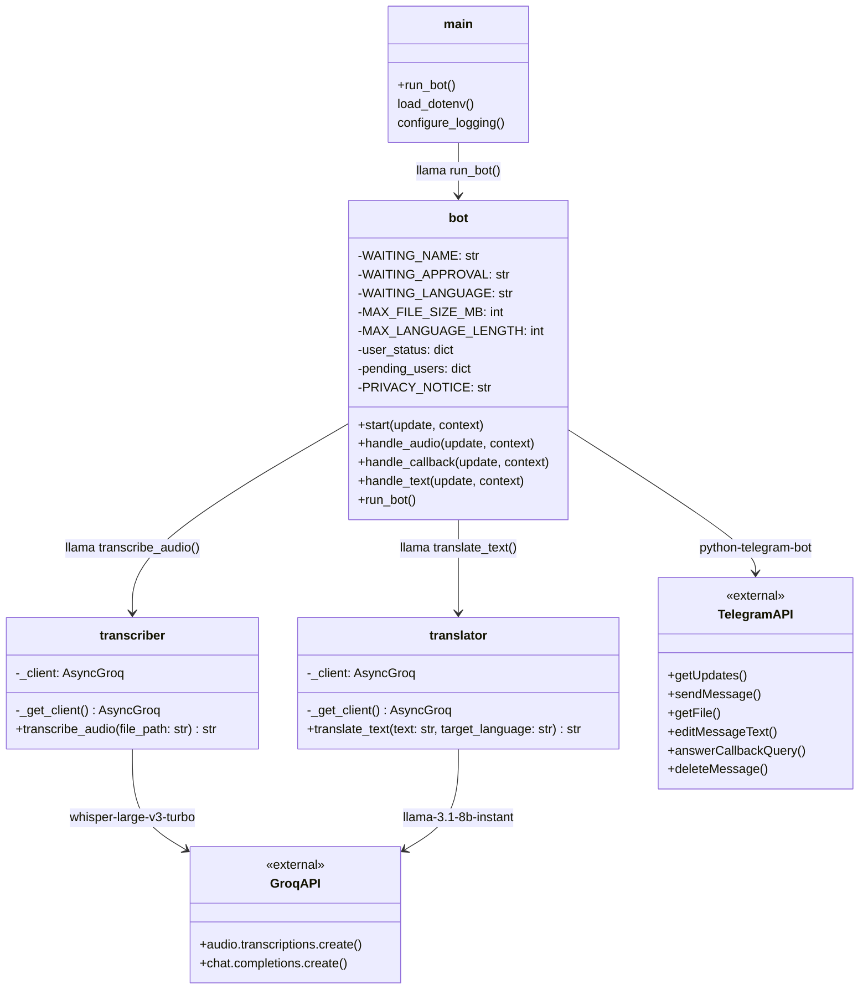

# Diagrama de Clases y Módulos

El proyecto está organizado en módulos Python. No utiliza clases orientadas a objetos de forma explícita, sino funciones y estado gestionado por `python-telegram-bot`. El diagrama refleja la estructura real de módulos, funciones y dependencias.

---

## Diagrama

---

## Descripción de módulos

### `main.py`
Punto de entrada de la aplicación. Carga las variables de entorno desde `.env`, configura el sistema de logging y arranca el bot.

### `src/bot.py`
Núcleo del bot. Gestiona el flujo completo de conversación, incluyendo registro de usuarios, aprobación de acceso, transcripción y traducción.

**Estado global en memoria:**

| Variable | Tipo | Descripción |
|---|---|---|
| `user_status` | `dict` | `{user_id: "approved" \| "pending" \| "rejected"}` |
| `pending_users` | `dict` | `{user_id: {"name": str}}` — solicitudes en espera de revisión |

**Estado por conversación (`context.user_data`):**

| Variable | Tipo | Descripción |
|---|---|---|
| `state` | `str \| None` | Estado del usuario: `WAITING_NAME`, `WAITING_APPROVAL`, `WAITING_LANGUAGE` o `None` |
| `last_transcription` | `str` | Última transcripción generada, disponible para traducción |

**Handlers registrados:**

| Handler | Trigger | Función |
|---|---|---|
| `CommandHandler("start")` | `/start` | `start()` — aviso de privacidad y flujo de registro |
| `MessageHandler(VOICE \| AUDIO)` | Audio o voz | `handle_audio()` — valida acceso, tamaño y transcribe |
| `CallbackQueryHandler` | Botones inline | `handle_callback()` — traducción y aprobación de admin |
| `MessageHandler(TEXT)` | Texto libre | `handle_text()` — nombre, espera o idioma según estado |

**Variables de entorno requeridas:**

| Variable | Descripción |
|---|---|
| `TELEGRAM_TOKEN` | Token del bot (BotFather) |
| `GROQ_API_KEY` | API key de Groq |
| `ADMIN_TELEGRAM_ID` | User ID numérico del administrador en Telegram |

### `src/transcriber.py`
Gestiona la transcripción de audio. Envía el archivo a la API de Groq (modelo `whisper-large-v3-turbo`) y retorna el texto. El cliente `AsyncGroq` se instancia una sola vez (singleton).

### `src/translator.py`
Gestiona la traducción de texto. Envía el texto y el idioma destino a Groq Chat Completions (modelo `llama-3.1-8b-instant`) con un prompt de sistema que instruye al LLM a devolver únicamente la traducción. El cliente `AsyncGroq` se instancia una sola vez (singleton).
