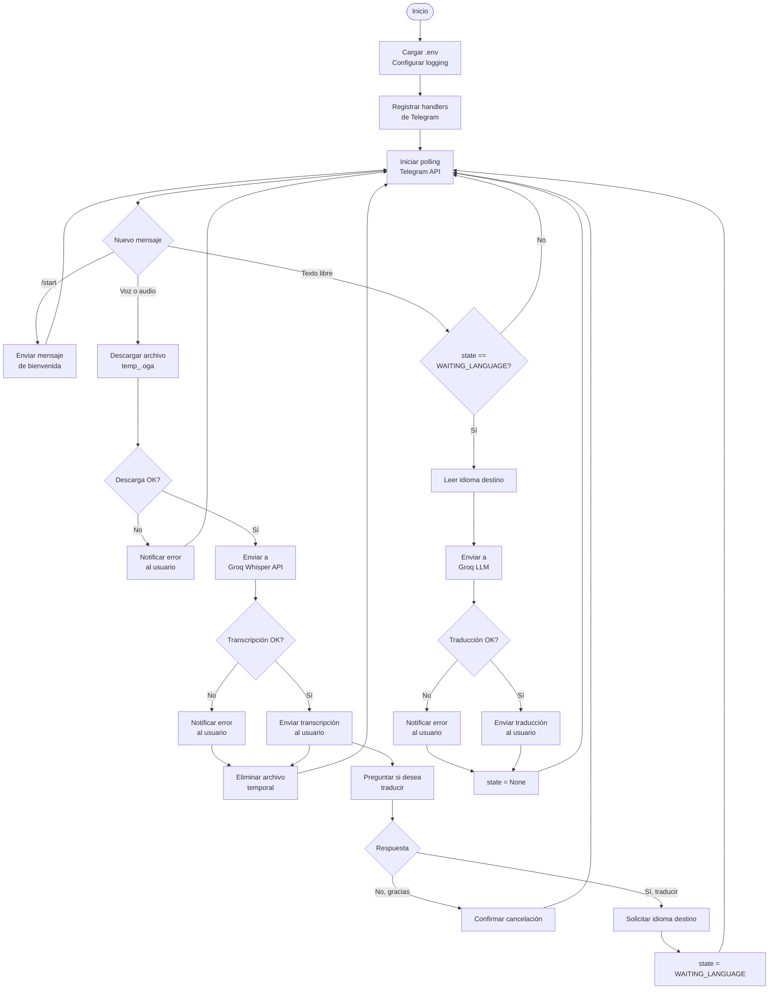
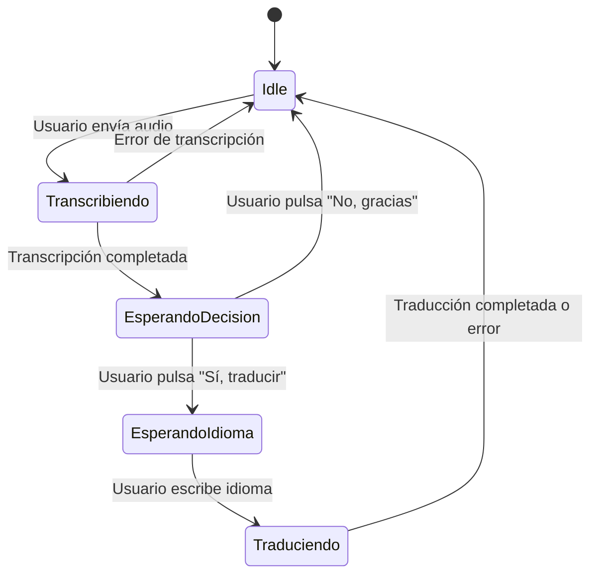
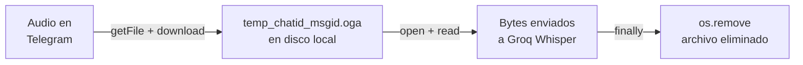

# Diagrama de Procesos

Flujo de ejecución completo del bot, incluyendo decisiones, estados y manejo de errores.

---

## Proceso principal

---

## Gestión del estado de conversación

El bot mantiene el estado de cada conversación en `context.user_data`. El único estado activo es `WAITING_LANGUAGE`, que indica que el bot está esperando que el usuario escriba el idioma de destino.

---

## Ciclo de vida de un archivo de audio

Los archivos temporales se eliminan siempre en el bloque `finally`, tanto si la transcripción tiene éxito como si falla, garantizando que no se acumulen en disco.
