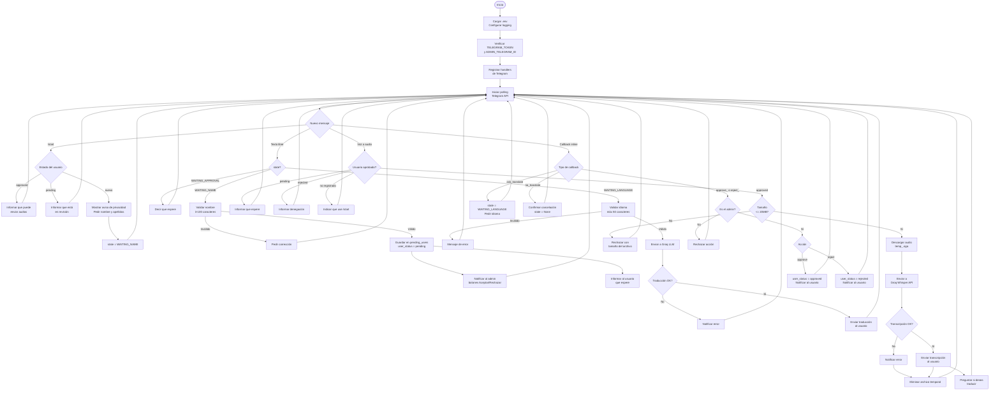
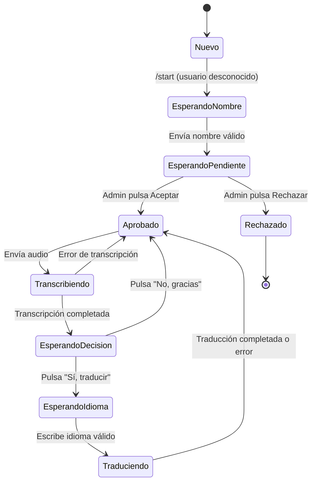
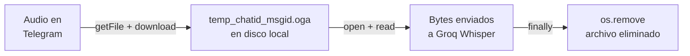

# Diagrama de Procesos

Flujo de ejecución completo del bot, incluyendo registro de usuarios, validaciones, transcripción, traducción y manejo de errores.

---

## Proceso principal

---

## Gestión del estado de conversación

El bot gestiona dos tipos de estado:

1. **`user_status`** (global, en memoria): indica si el usuario está aprobado, pendiente o rechazado
2. **`context.user_data["state"]`** (por conversación): indica en qué paso del flujo está el usuario

---

## Ciclo de vida de un archivo de audio

Los archivos temporales se eliminan siempre en el bloque `finally`, tanto si la transcripción tiene éxito como si falla, garantizando que no se acumulen en disco.
