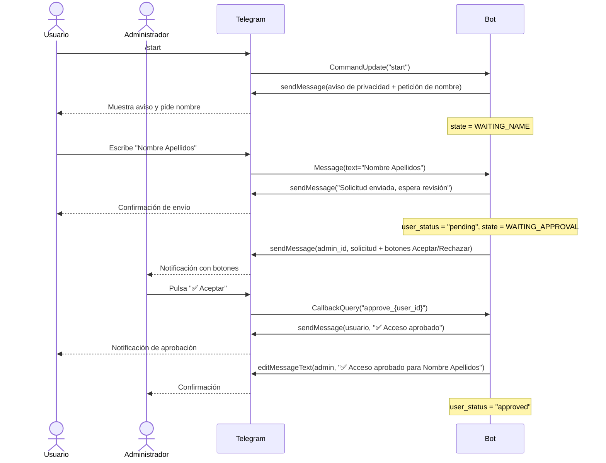
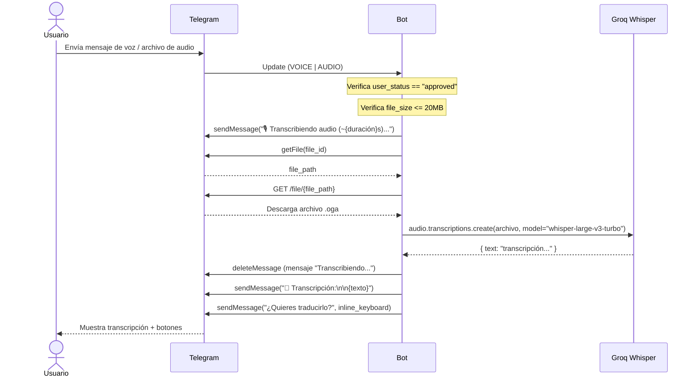
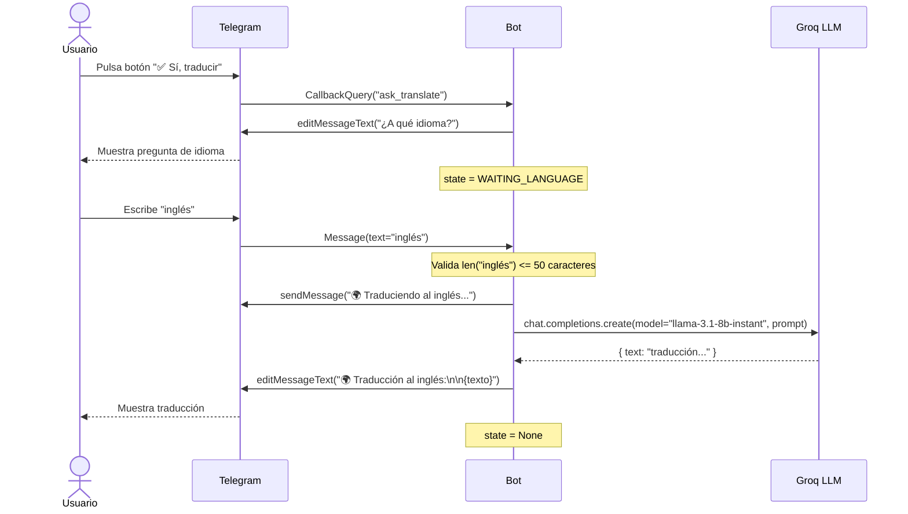
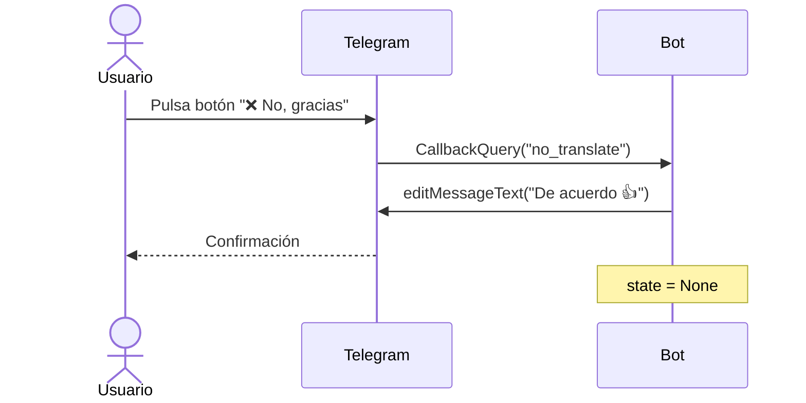
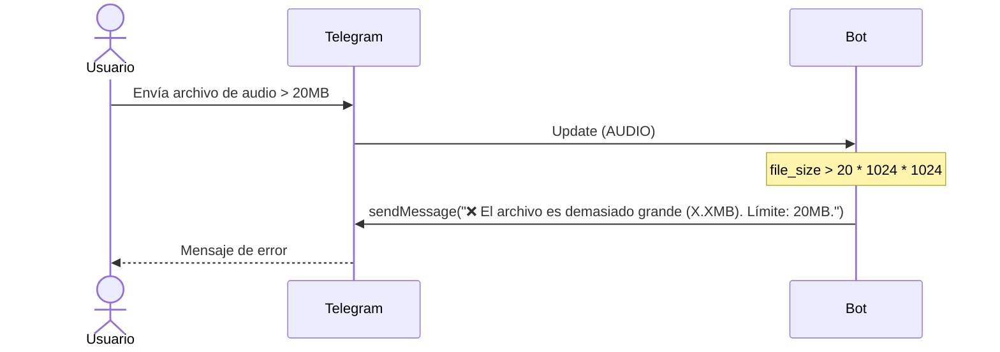
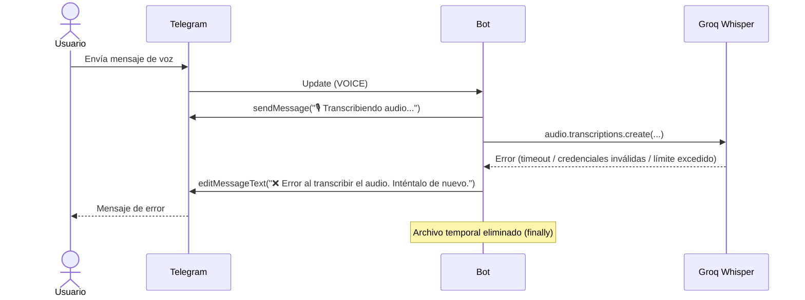

# Diagramas de Secuencia

---

## SD1 — Registro de usuario nuevo

Flujo completo desde que un nuevo usuario escribe `/start` hasta que recibe la aprobación o rechazo del administrador.

---

## SD2 — Transcripción de audio

Flujo completo desde que un usuario aprobado envía un audio hasta que recibe la transcripción.

---

## SD3 — Traducción de transcripción

---

## SD4 — Cancelación de traducción

---

## SD5 — Rechazo por archivo demasiado grande

---

## SD6 — Error en transcripción

