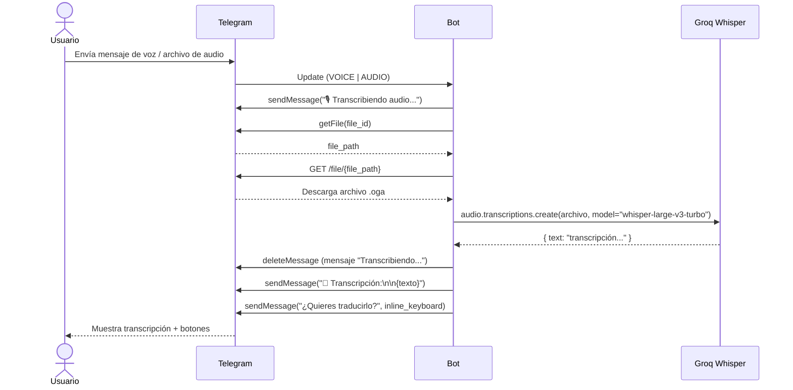
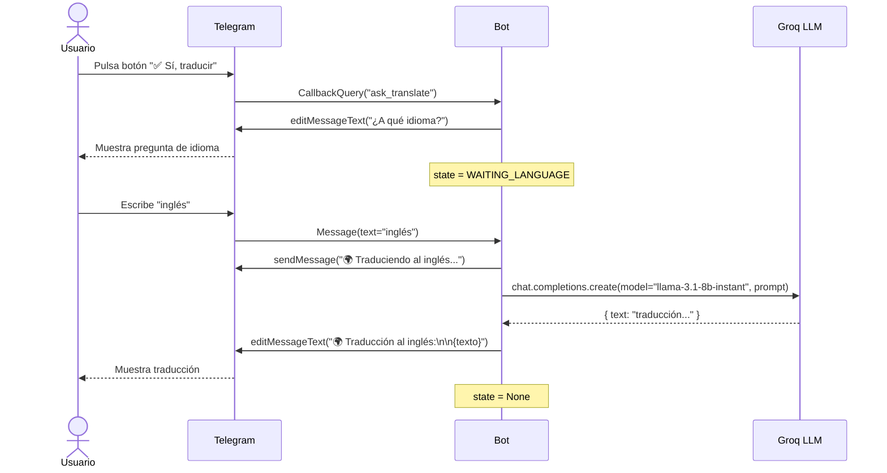
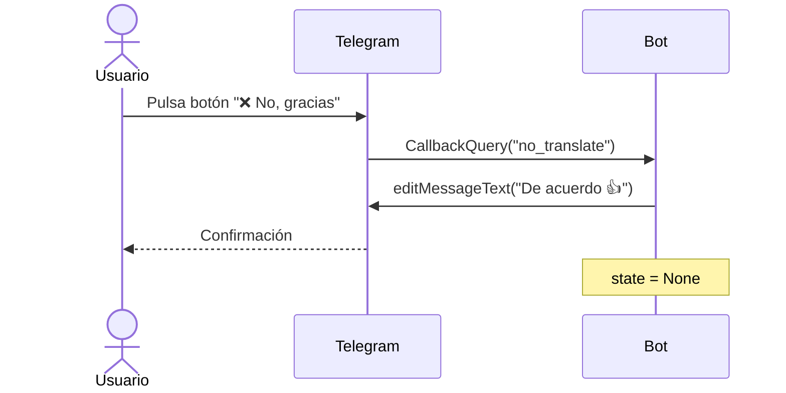
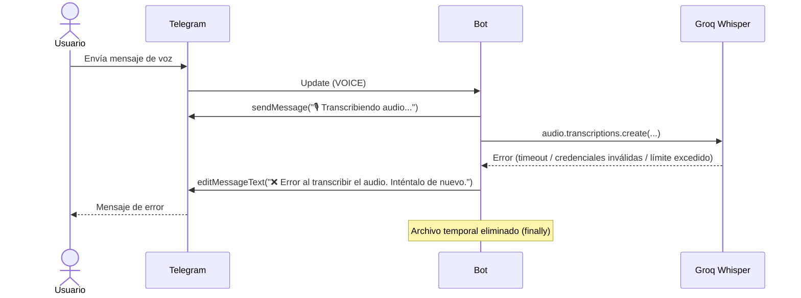

# Diagramas de Secuencia

---

## SD1 — Transcripción de audio

Flujo completo desde que el usuario envía un audio hasta que recibe la transcripción.

---

## SD2 — Traducción de transcripción

Flujo desde que el usuario acepta traducir hasta recibir el resultado.

---

## SD3 — Cancelación de traducción

---

## SD4 — Flujo de error en transcripción

