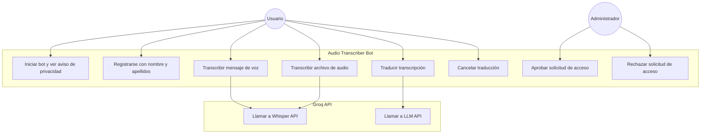

# Casos de Uso

## Actores

| Actor | Descripción |
|---|---|
| **Usuario** | Persona que interactúa con el bot a través de Telegram. Debe registrarse y ser aprobada por el administrador antes de poder usarlo |
| **Administrador** | Propietario del bot. Recibe las solicitudes de acceso y decide si aprobarlas o rechazarlas |
| **Groq API** | Servicio externo que provee transcripción (Whisper large-v3-turbo) y traducción (Llama 3.1 8B) |

---

## Diagrama de casos de uso

---

## Descripción de casos de uso

### UC1 — Iniciar bot y ver aviso de privacidad

| Campo | Descripción |
|---|---|
| **Actor** | Usuario |
| **Precondición** | El bot está en ejecución |
| **Trigger** | El usuario envía `/start` |
| **Flujo principal** | 1. El bot muestra el aviso de privacidad (datos procesados por Groq, EEUU) 2. Si el usuario ya está aprobado, le informa de que puede enviar audios 3. Si está pendiente, le informa de que su solicitud está en revisión 4. Si es nuevo, le pide nombre y apellidos para registrarse |
| **Postcondición** | El usuario conoce la política de privacidad y sabe cuál es su estado |

---

### UC2 — Registrarse con nombre y apellidos

| Campo | Descripción |
|---|---|
| **Actor** | Usuario, Administrador |
| **Precondición** | El usuario ha leído el aviso de privacidad y está en estado `WAITING_NAME` |
| **Trigger** | El usuario envía su nombre y apellidos |
| **Flujo principal** | 1. El bot valida que el nombre tiene entre 3 y 100 caracteres 2. Guarda la solicitud en memoria con estado `pending` 3. Notifica al administrador con botones Aceptar/Rechazar 4. Informa al usuario de que su solicitud está en revisión |
| **Flujo alternativo** | Si el nombre es demasiado corto o largo, el bot pide que lo corrija |
| **Postcondición** | El administrador ha recibido la solicitud y el usuario queda en estado `pending` |

---

### UC3 — Transcribir mensaje de voz

| Campo | Descripción |
|---|---|
| **Actor** | Usuario, Groq API |
| **Precondición** | El usuario está aprobado. El archivo no supera los 20MB |
| **Trigger** | El usuario envía un mensaje de voz en Telegram |
| **Flujo principal** | 1. El bot verifica que el usuario está aprobado 2. Verifica el tamaño del archivo (máx. 20MB) 3. Descarga el archivo `.oga` de los servidores de Telegram 4. Muestra la duración aproximada del audio 5. Envía el audio a Groq Whisper API 6. Devuelve la transcripción al usuario 7. Pregunta si desea traducirlo |
| **Flujo alternativo** | Si el usuario no está aprobado, el bot le indica que use `/start`. Si el archivo supera el límite, notifica el tamaño y rechaza |
| **Postcondición** | El usuario recibe el texto transcrito |

---

### UC4 — Transcribir archivo de audio

| Campo | Descripción |
|---|---|
| **Actor** | Usuario, Groq API |
| **Precondición** | El usuario está aprobado |
| **Trigger** | El usuario envía un archivo de audio (mp3, wav, m4a, etc.) |
| **Flujo principal** | Idéntico a UC3 |
| **Postcondición** | El usuario recibe el texto transcrito |

---

### UC5 — Traducir transcripción

| Campo | Descripción |
|---|---|
| **Actor** | Usuario, Groq API |
| **Precondición** | Existe una transcripción reciente en la sesión del usuario |
| **Trigger** | El usuario pulsa el botón "✅ Sí, traducir" |
| **Flujo principal** | 1. El bot solicita el idioma destino 2. El usuario escribe el idioma (máx. 50 caracteres) 3. El bot envía el texto a Groq LLM con instrucciones de traducción 4. Recibe la traducción y la envía al usuario |
| **Flujo alternativo** | Si el idioma supera 50 caracteres, el bot muestra un error. Si Groq falla, notifica al usuario |
| **Postcondición** | El usuario recibe el texto traducido al idioma solicitado |

---

### UC6 — Cancelar traducción

| Campo | Descripción |
|---|---|
| **Actor** | Usuario |
| **Precondición** | El bot ha preguntado si desea traducir |
| **Trigger** | El usuario pulsa el botón "❌ No, gracias" |
| **Flujo principal** | El bot confirma la cancelación y vuelve al estado `Idle` |
| **Postcondición** | La sesión queda limpia y el bot espera nuevos audios |

---

### UC7 — Aprobar solicitud de acceso

| Campo | Descripción |
|---|---|
| **Actor** | Administrador |
| **Precondición** | Existe una solicitud pendiente |
| **Trigger** | El administrador pulsa "✅ Aceptar" en el mensaje de notificación |
| **Flujo principal** | 1. El bot verifica que quien pulsa es el administrador 2. Marca al usuario como `approved` en memoria 3. Notifica al usuario de que su acceso fue aprobado 4. Actualiza el mensaje del administrador con la confirmación |
| **Postcondición** | El usuario puede enviar audios al bot |

---

### UC8 — Rechazar solicitud de acceso

| Campo | Descripción |
|---|---|
| **Actor** | Administrador |
| **Precondición** | Existe una solicitud pendiente |
| **Trigger** | El administrador pulsa "❌ Rechazar" |
| **Flujo principal** | 1. El bot verifica que quien pulsa es el administrador 2. Marca al usuario como `rejected` 3. Notifica al usuario de que su acceso fue denegado |
| **Postcondición** | El usuario no puede usar el bot |
