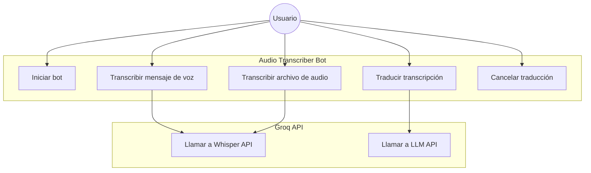

# Casos de Uso

## Actores

| Actor | Descripción |
|---|---|
| **Usuario** | Persona que interactúa con el bot a través de Telegram |
| **Groq API** | Servicio externo que provee transcripción (Whisper) y traducción (Llama 3.1) |

---

## Diagrama de casos de uso

---

## Descripción de casos de uso

### UC1 — Iniciar bot

| Campo | Descripción |
|---|---|
| **Actor** | Usuario |
| **Precondición** | El bot está en ejecución |
| **Trigger** | El usuario envía `/start` |
| **Flujo principal** | El bot responde con un mensaje de bienvenida explicando su función |
| **Postcondición** | El usuario sabe cómo usar el bot |

---

### UC2 — Transcribir mensaje de voz

| Campo | Descripción |
|---|---|
| **Actor** | Usuario, Groq API |
| **Precondición** | El bot está en ejecución y las credenciales de Groq son válidas |
| **Trigger** | El usuario envía un mensaje de voz en Telegram |
| **Flujo principal** | 1. El bot descarga el archivo de audio `.oga` de los servidores de Telegram 2. Envía el audio a Groq Whisper API 3. Recibe la transcripción 4. Envía el texto al usuario 5. Pregunta si desea traducirlo |
| **Flujo alternativo** | Si Groq devuelve error, el bot notifica al usuario y termina |
| **Postcondición** | El usuario recibe el texto transcrito |

---

### UC3 — Transcribir archivo de audio

| Campo | Descripción |
|---|---|
| **Actor** | Usuario, Groq API |
| **Precondición** | El bot está en ejecución |
| **Trigger** | El usuario envía un archivo de audio (mp3, wav, m4a, etc.) |
| **Flujo principal** | Idéntico a UC2 |
| **Postcondición** | El usuario recibe el texto transcrito |

---

### UC4 — Traducir transcripción

| Campo | Descripción |
|---|---|
| **Actor** | Usuario, Groq API |
| **Precondición** | Existe una transcripción reciente en la sesión del usuario |
| **Trigger** | El usuario pulsa el botón "✅ Sí, traducir" |
| **Flujo principal** | 1. El bot solicita el idioma destino 2. El usuario escribe el idioma (ej: "inglés") 3. El bot envía el texto a Groq LLM con instrucciones de traducción 4. Recibe la traducción y la envía al usuario |
| **Flujo alternativo** | Si Groq devuelve error, el bot notifica al usuario |
| **Postcondición** | El usuario recibe el texto traducido al idioma solicitado |

---

### UC5 — Cancelar traducción

| Campo | Descripción |
|---|---|
| **Actor** | Usuario |
| **Precondición** | Existe una transcripción reciente y el bot ha preguntado si desea traducir |
| **Trigger** | El usuario pulsa el botón "❌ No, gracias" |
| **Flujo principal** | El bot confirma la cancelación y cierra la interacción |
| **Postcondición** | La sesión queda limpia y el bot espera nuevos audios |
